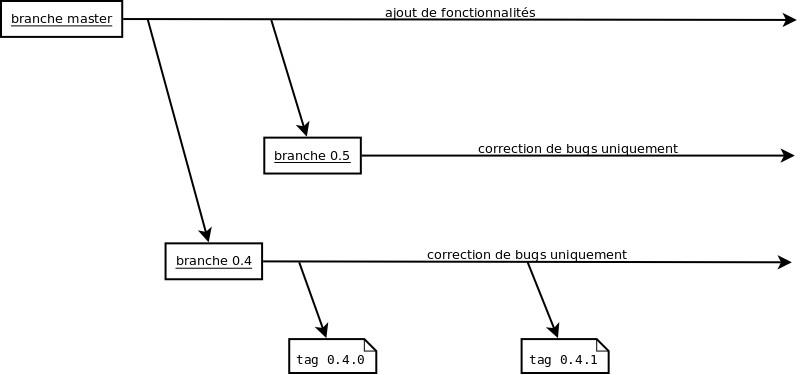

=============
Développement
=============

Voici le cycle de développement adopté pour la sortie des versions:

Modèles
=======

Voici le schèma général des différentes classes utilisées.

.. image:: images/models-base.png
   :height: 100
   :width: 200
   :scale: 50
   :alt: Schéma des classes d'objets

À nouveau les différentes classes avec leurs héritages.

.. inheritance-diagram:: possum.base.models
   :parts: 1

La classe centrale, et donc la plus importante, est la classe Facture_.

Accompagnement
--------------

.. inheritance-diagram:: possum.base.models.Accompagnement
   :parts: 1

.. autoclass:: possum.base.models.Accompagnement
   :members:
.. _categorie:

Categorie
---------

.. inheritance-diagram:: possum.base.models.Categorie
   :parts: 1

.. autoclass:: possum.base.models.Categorie
   :members:

Couleur
-------

.. inheritance-diagram:: possum.base.models.Couleur
   :parts: 1

.. autoclass:: possum.base.models.Couleur
   :members:

Cuisson
-------

.. inheritance-diagram:: possum.base.models.Cuisson
   :parts: 1

.. autoclass:: possum.base.models.Cuisson
   :members:

Etat
----

.. inheritance-diagram:: possum.base.models.Etat
   :parts: 1

.. autoclass:: possum.base.models.Etat
   :members:

.. _Facture:

Facture
-------

.. inheritance-diagram:: possum.base.models.Facture
   :parts: 1

.. autoclass:: possum.base.models.Facture
   :members:

Log
---

.. inheritance-diagram:: possum.base.models.Log
   :parts: 1

.. autoclass:: possum.base.models.Log
   :members:

LogType
-------

.. inheritance-diagram:: possum.base.models.LogType
   :parts: 1

.. autoclass:: possum.base.models.LogType
   :members:

Paiement
--------

.. inheritance-diagram:: possum.base.models.Paiement
   :parts: 1

.. autoclass:: possum.base.models.Paiement
   :members:

PaiementType
------------

.. inheritance-diagram:: possum.base.models.PaiementType
   :parts: 1

.. autoclass:: possum.base.models.PaiementType
   :members:

Produit
-------

.. inheritance-diagram:: possum.base.models.Produit
   :parts: 1

.. autoclass:: possum.base.models.Produit
   :members:

ProduitVendu
------------

.. inheritance-diagram:: possum.base.models.ProduitVendu
   :parts: 1

.. autoclass:: possum.base.models.ProduitVendu
   :members:
.. _sauce:

Sauce
-----

.. inheritance-diagram:: possum.base.models.Sauce
   :parts: 1

.. autoclass:: possum.base.models.Sauce
   :members:
.. _suivi:

Suivi
-----

.. inheritance-diagram:: possum.base.models.Suivi
   :parts: 1

.. autoclass:: possum.base.models.Suivi
   :members:
.. _table:

Table
-----

.. inheritance-diagram:: possum.base.models.Table
   :parts: 1

.. autoclass:: possum.base.models.Table
   :members:
.. _zone:

Zone
----

.. autoclass:: possum.base.models.Zone
   :members:

Qualité
=======

La qualité générale de Possum est mesurée par Pylint.
La définition de tous les codes est `ici <http://pylint-messages.wikidot.com/all-codes>`_.

.. raw:: html
   :file: qualite.html

Les bugs
========

Nouveau bug
-----------

Lorsque vous avez trouvé un bug, vous pouvez vérifier en tout premier si ce bug est déjà connu. 
Pour cela, il suffit de consulter la page suivante: `GitHub <https://github.com/possum-software/possum/issues>`_.

Si votre bug est inconnu, alors nous vous serons reconnaissant de décrire ce bug et si possible les conditions
pour le recréer à la même adresse que ci-dessus.

Note importante: 

Si le bug est un bug de sécurité, il est préférable d'envoyer un mail à `la liste de 
de diffusion dédiée <https://possum.insa-rouen.fr/cgi-bin/mailman/listinfo/security>`_ et de ne pas
créer un bug dans le gestionnaire de bug. En effet, on essayera de corriger le bug de sécurité avant
de le rendre public.

Correction d'un bug
-------------------

Cette section concerne surtout les développeurs.

Si vous avez corriger un bug qui est référencé dans le gestionnaire de bug, alors vous pouvez le fermer
automatiquement avec l'opération de commit en utilisant son numéro d'identifiant. Par exemple pour fermer
le bug numéro 42, il vous suffira d'ajouter dans le commentaire du commit: ''Closes #42''.

Si votre commit est en relation avec un bug mais ne le ferme pas, alors il suffit d'indiquer le numéro
du bug dans le commentaire du commit. Par exemple: ''Prépare la correction de #42.''.

